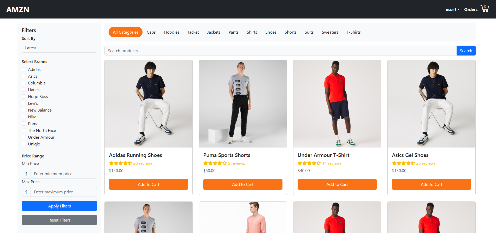
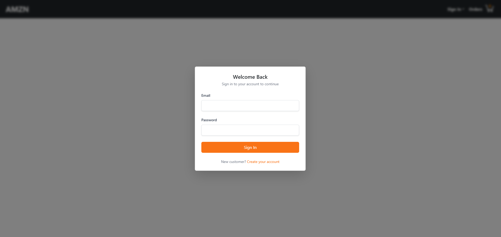
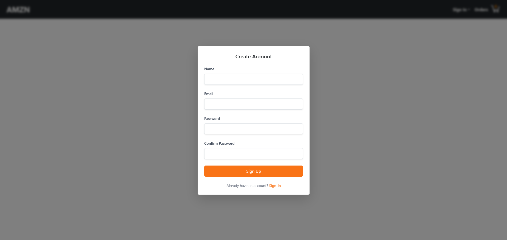
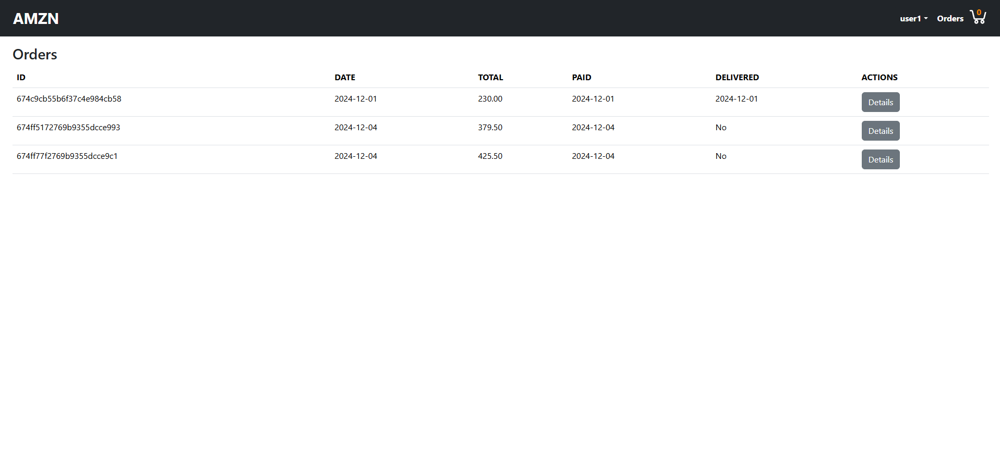
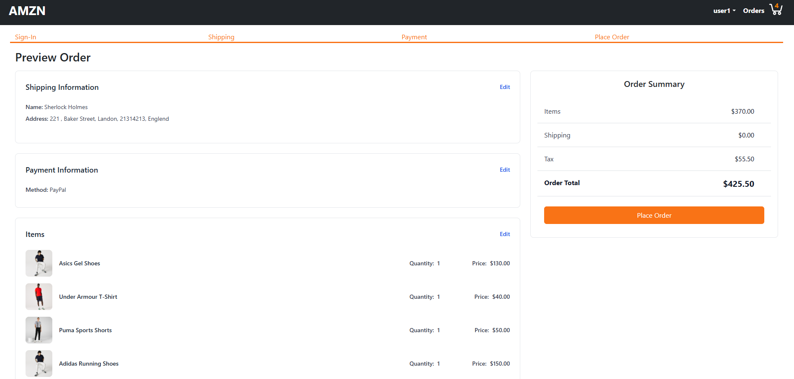
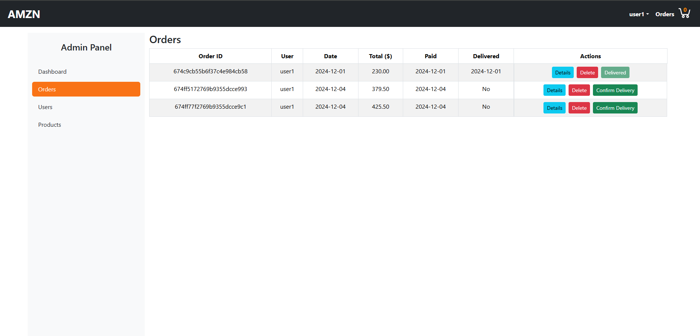
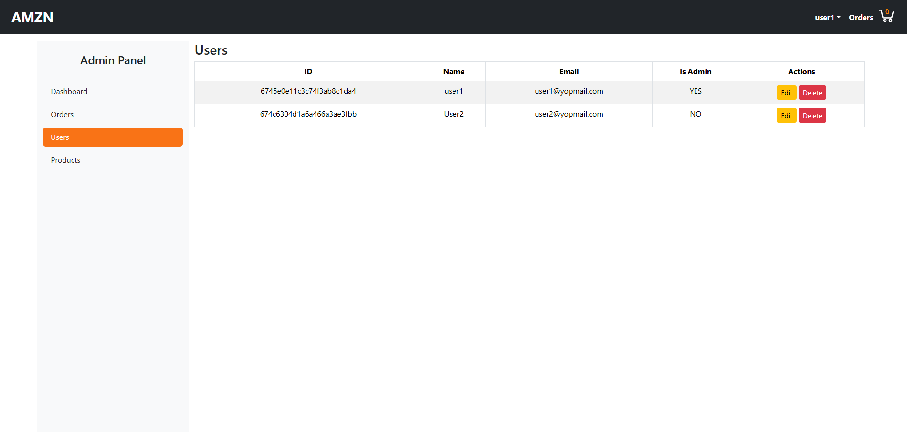
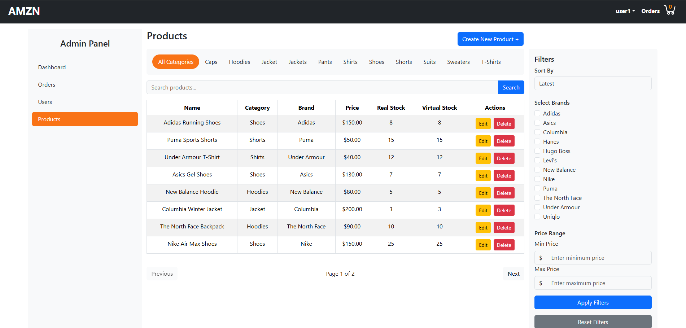

# E-Commerce Website using MERN Stack

## Version
0.1.0

## Introduction

Welcome to the E-Commerce Website using MERN Stack with TypeScript. This e-commerce platform facilitates guest users in product browsing and cart management. Upon signing in, users can provide details, create and subsequently confirm their orders. Admin users possess the authority to manage user accounts, products and orders. The platform incorporates a security system fortified by JSON Web Tokens (JWT).

### Features

- **User Authentication:** Users can sign up securely to access personalized features.
- **Product Cart:** Add products to a cart and manage the items.
- **Shipping Address:** Provide a shipping address for order delivery.
- **Payment Method:** Choose a payment method for completing the order.
- **Order Preview and Confirmation:** Review the order details before confirming the purchase.

### Preview
#### Product Routes

  
  

#### User Routes

  
  

  

#### Order Routes

  
  

  
  

  

#### Admin Routes

  
  

  

### Technologies Used

#### Frontend

- **Framework:** React
- **State Management:** useContext
- **Data Fetching state Management:** React Query
- **HTTP Client:** Axios
- **UI Framework:** React-Bootstrap
- **Routing:** React Router
- **Toast Notifications:** React Toastify

#### Backend

- **Framework:** Node.js with Express
- **Database:** MongoDB with Mongoose
- **Object Modeling:** Typegoose
- **Authentication:** JSON Web Token (jsonwebtoken)
- **Middleware:** CORS, Express Async Handler

## Usage Disclaimer

This project and its associated images are used for educational and learning purposes. The application and any included images are not intended for commercial use.

## License

Copyright &copy; 2024 [Your Name]. All Rights Reserved  
This project is licensed under the [MIT License](LICENSE.txt).
