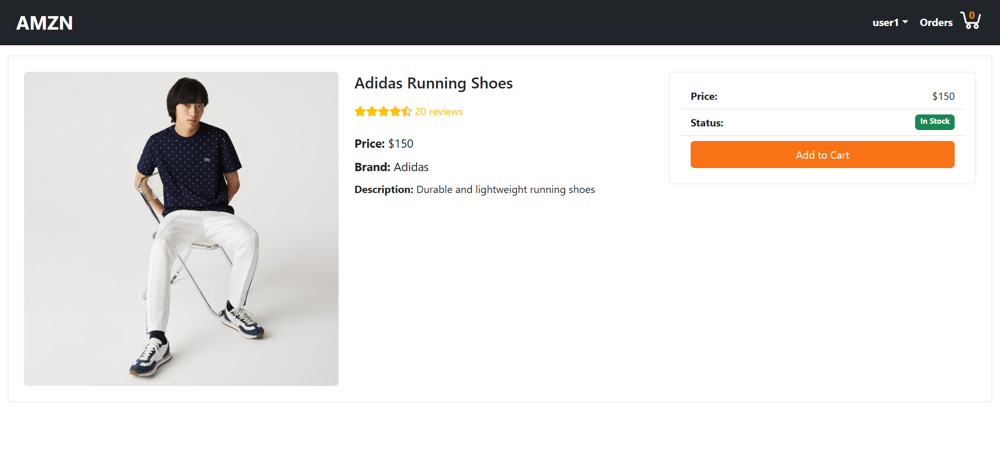
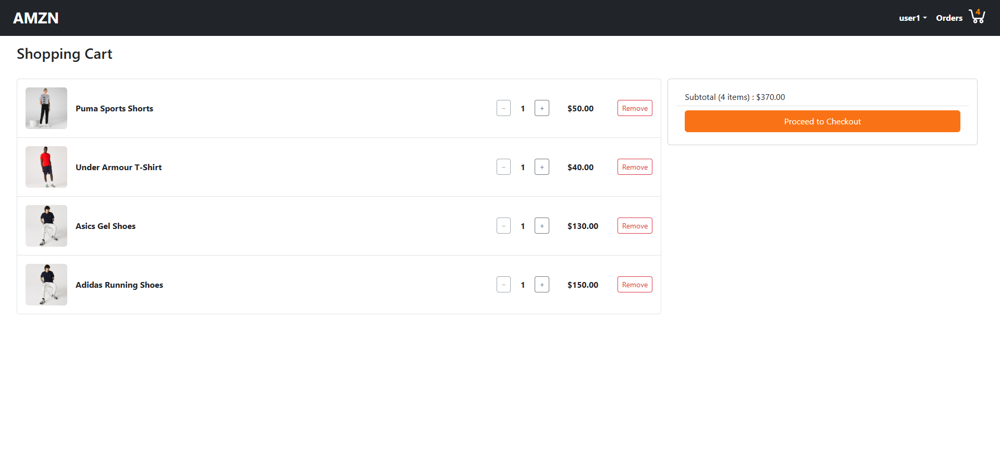
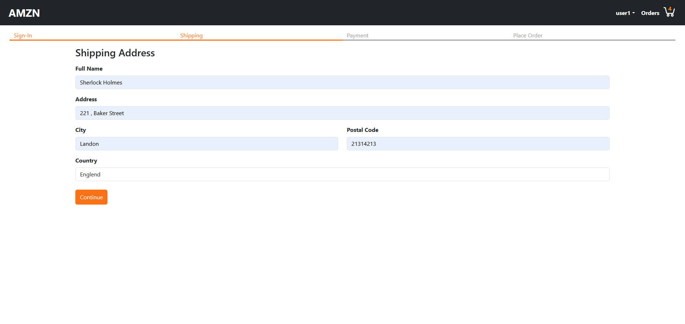
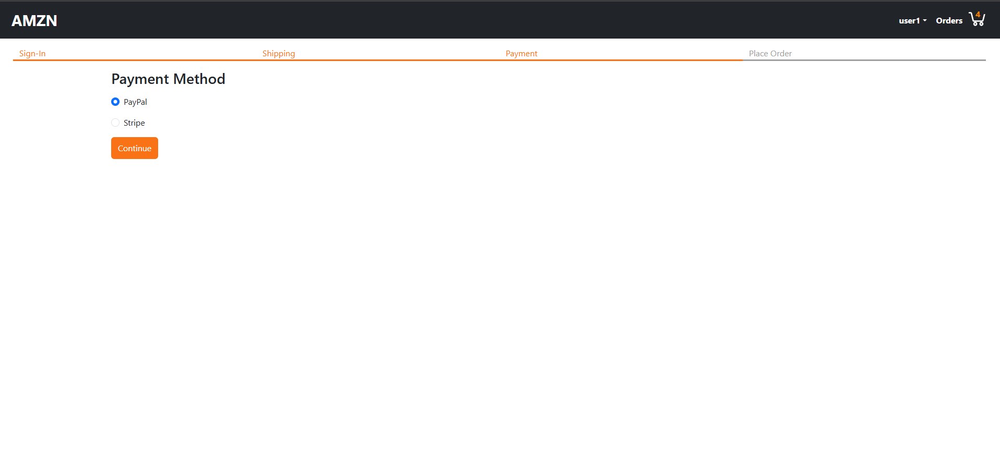
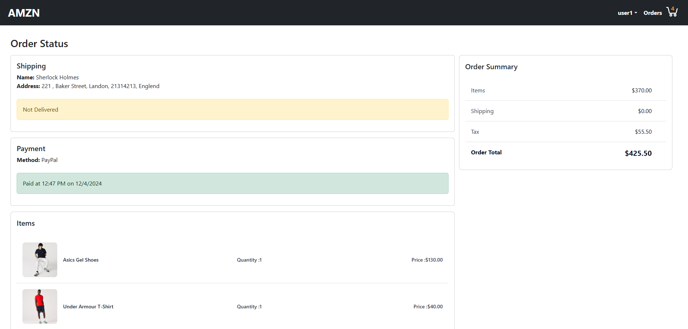

# E-Commerce Website using MERN Stack

## Version
0.1.0

## Introduction

Welcome to the E-Commerce Website using MERN Stack with TypeScript. This application provides a seamless online shopping experience, allowing users to sign up, add products to a cart, provide shipping address and payment method, and preview and confirm their orders.

### Features

- **User Authentication:** Users can sign up securely to access personalized features.
- **Product Cart:** Add products to a cart and manage the items.
- **Shipping Address:** Provide a shipping address for order delivery.
- **Payment Method:** Choose a payment method for completing the order.
- **Order Preview and Confirmation:** Review the order details before confirming the purchase.

  #### Preview

### Technologies Used

#### Frontend

- **Framework:** React
- **State Management:** useContext
- **Data Fetching state Management:** React Query
- **HTTP Client:** Axios
- **UI Framework:** React-Bootstrap
- **Routing:** React Router
- **Toast Notifications:** React Toastify

#### Backend

- **Framework:** Node.js with Express
- **Database:** MongoDB with Mongoose
- **Object Modeling:** Typegoose
- **Authentication:** JSON Web Token (jsonwebtoken)
- **Middleware:** CORS, Express Async Handler

## Usage Disclaimer

This project and its associated images are used for educational and learning purposes. The application and any included images are not intended for commercial use.

## License

Copyright &copy; 2024 [Your Name]. All Rights Reserved  
This project is licensed under the [MIT License](LICENSE.txt).
